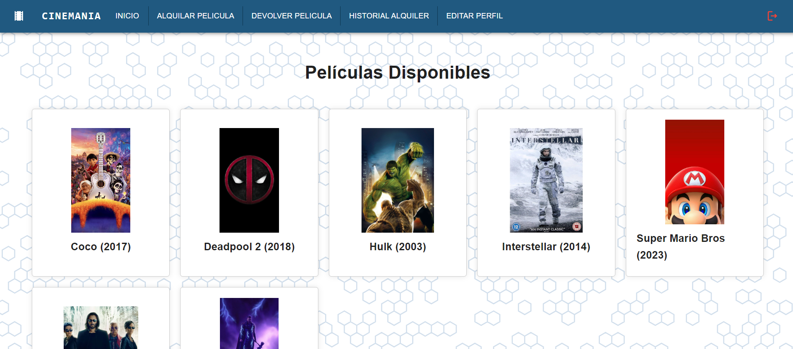
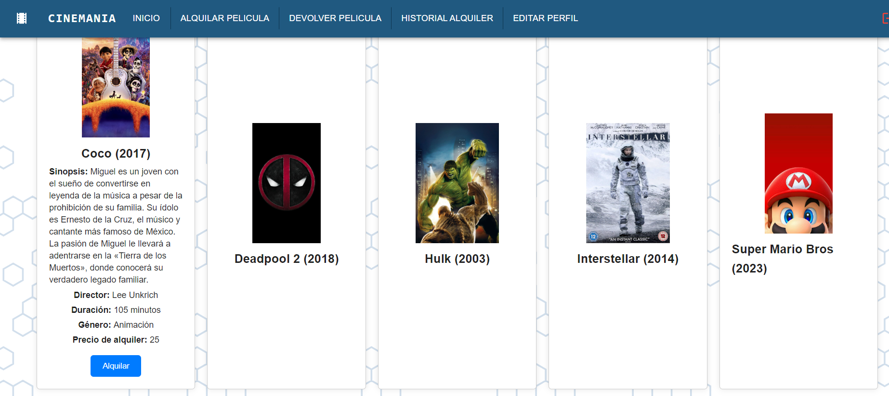

#### Universidad de San Carlos de Guatemala
#### Facultad de Ingenieria
#### Seminario de Sistemas 1 - "B"
#### Auxiliar: Luis Enrique Rivera Najera
       

<strong> Proyecto 1  
</strong>

       

| Integrantes                    | Carnet    |
| :---:                               |  :----:  |
| Gladys Leticia Ajuchán Vicente      | 201807389|
| Eduardo Alexander Reyes Gonzalez    | 202010904|
| Heidy Beatriz Miranda Gámez         | 201709051|
| Rubén Alejandro Ralda Mejia         | 202111835|
| Kevin Josué Xiloj Subuyú            | 202000660|

  

---
# DIAGRAMA ENTIDAD RELACION

# DIAGRAMA DE CLASES

# DIAGRAMA DE COMPONENTES

# DIAGRAMA DE DESPLIEGUE

# MANUAL TECNICO
# Frontend
Para el frontend se utilizo la React + Vite   
Vite es un paquete de JS el cual toma el codigo React JSX y lo transforma en archivos HTML, CSS y JS sin formato el cual pueden ejecutar la mayoria de navegadores.   

React es una de las librerias mas populares de Javascript para el desarrollo de aplicaciones moviles y web. 

## Login
En el login se crearon formularios los cuales obtienen el correo y la contraseña las cuales se envian al backend. El backend compara los datos con la base de datos, y si encontro un registro igual, entonces retorna al frontend un mensaje de exito, y este redirige al usuario su ventana respectiva. Si el usuario no posee una cuenta entonces desde el frontend se mostrara un boton el cual lo redirigira a la ventana para registrar sus datos.

## Registro
En esta ventana se recopila toda la informacion del usuario, el cual es Nombre, Apellido, Genero, Email, Fecha de nacimiento y contraseña, Cuando el usuario presiona el boton registrar esa informacion se envia al backend y se verifica que no exista un usuario con ese mismo correo. si no existe ningun usuario igual, entonces se almacena en la base de datos, retornando un mensaje de exito.

## Dashboard Usuario
### Página Principal
El usuario tiene la posibilidad de visualizar el catálogo de películas del sitio, con su información y comentarios.

En este apartado el usuario tiene a su disposicion varias funcionalidades, como son:

<li>Comentar Contenido</li>
<li>Alquiler Películas</li>
<li>Devolver Película</li>
<li>Historial de Alquiler</li>
<li>Editar Perfil</li>

### Comentar Contenido
El usuario tiene la posibilidad de visualizar, agregar y eliminar sus comentarios a las diferentes peliculas que puede encontrar.

### Alquiler de Peliculas
El usuario tiene la posibilidad de alquilar peliculas de las que aparecen en pantalla. Si esta ya esta alquilada entonces ya no la podra alquilar, por lo que no será visible en esta pantalla.

Al hacer clic sobre la película se desplegará la información con el botón alquilar 

Luego de confirmar la cita se desplegará mensaje de pelicula alquilada exitosamente, y se eliminará de la lista de peliculas disponibles.

### Devolver pelicula
El usuario despues de alquilar una pelicula debe devolverla en su devido tiempo teniendo que pagar el monto que se especifico + multa si se excedio con el tiempo de devolucion

### Historial de alquiler
El usuario puede visualizar el historial de las peliculas que ha alquilado a traves del tiempo.

### Editar perfil
El usuario tiene la posibilidad de editar la informacion que proporciono en el apartado de registro y modificar toda su informacion con excepcion del Email.

En caso que el usuario no ingrese correctamente su contraseña actual mostrará error

Si los datos fueron correctamente ingresados se almacenan y muestra mensaje correcto.

## Dashboard Administrador
El administrador es el usuario con mayor privilegio en esta aplicacion debido a que tiene el control total de las peliculas y usuarios, pudiendo eliminarlos. las funcionalidades que posee el administrador son las siguientes:  

<li>Ingreso de peliculas</li>
<li>Actualizacion de contenido</li>
<li>Eliminacion de contenido</li>
<li>Eliminacion de usuarios</li>

### Ingreso de Peliculas
El administrador tiene la posibilidad de agregar contenido nuevo en el cual puede ser alquilado por los usuarios.

### Actualizacion de contenido
El administrador puede tambien modificar la informacion de las peliculas que ya se encuentran para alquiler

### Eliminacion de contenido
El usuario puede quitar peliculas que desee y ya no seran accessibles por los usuarios.

### Eliminacion de usuarios
El administrador tambien puede eliminar usuarios de forma permanente

# Backend
En el backend se utilizo la herramienta Node para crear el servidor que sirve al frontend. 
Node es un entorno de ejecucion en tiempo real que incluye todo lo que necesita para ejecutar un programa escrito en javascript.

Este utiliza un modelo de entrada y de salida sin bloqueo controlado por eventos que lo hace ligero y eficiente.

En este backend se poseen todos los endpoints necesarios para manipulacion de informacion de la base de datos. los cuales son:
<li>Agregar informacion</li>
<li>Actualizacion de informacion</li>
<li>Eliminacion de informacion</li>
 
Estas funciones se aplican a cada entidad de la base de datos.

# Base de datos
La base de datos que se utilizo en el proyecto fue MySQL debido a que es una base de datos facil de utilizar. Aqui se almacena toda la informacion de los usuarios, peliculas, comentarios y alquileres. 
    

# LINK HERRAMIENTA DE GESTION DE PROCESOS PARA TABLERO KANBAN
### https://trello.com/b/44XOUR8A/ayd1p1g5

 

# CAPTURAS DEL TABLERO KANBAN
### Inicio Sprint

### Durante el sprint

### Finalizacion del sprint

 

# LINK GRABACIONES REALIZADAS

### Sprint Planning: https://www.youtube.com/watch?si=rF1inIjX6EEvZpTi&v=VLenI-e6YtM&feature=youtu.be

### Daily Scrum  No.1: https://www.youtube.com/watch?feature=shared&v=dzoR2Kc7Agw

### Daily Scrum  No.2: https://youtu.be/pc0_HK1fiXY

### Daily Scrum  No.3: https://www.youtube.com/watch?v=cvUX52Fyqj4

### Sprint Retrospective: https://www.youtube.com/watch?v=st6mD8cNN_E